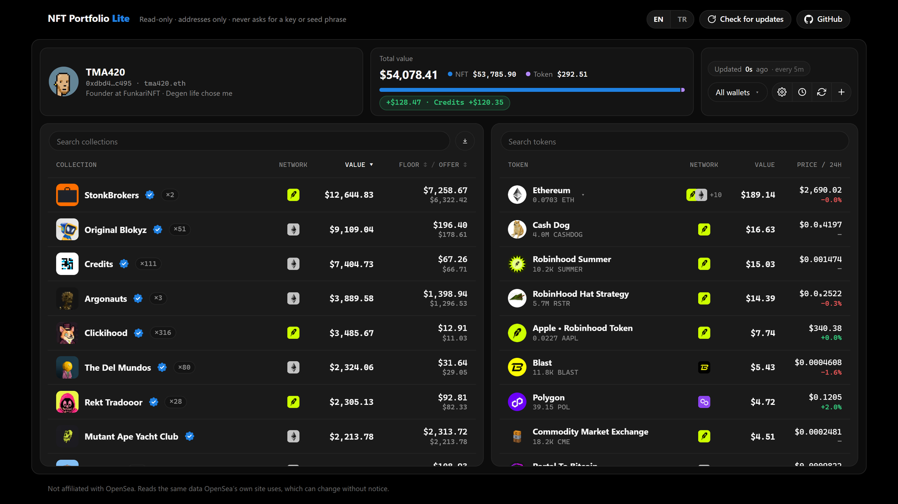
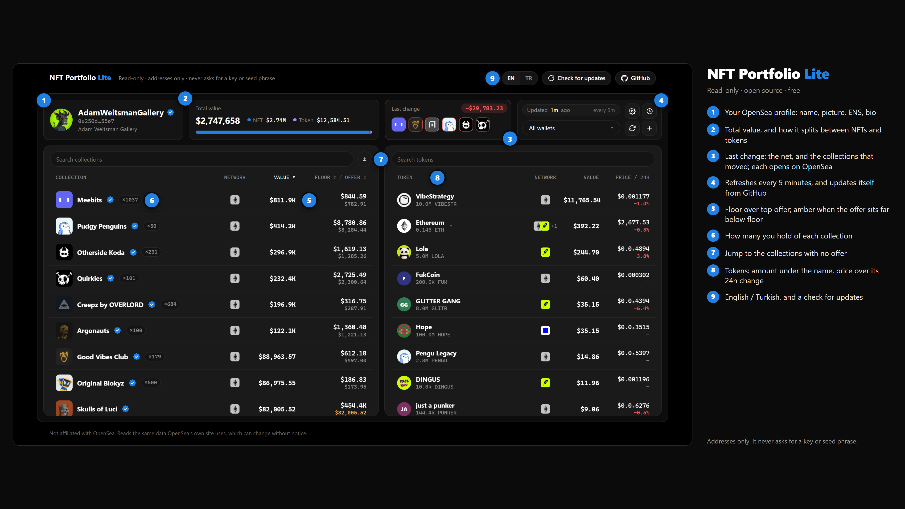
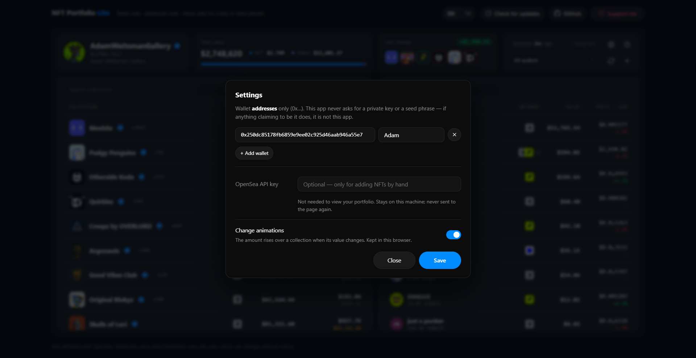
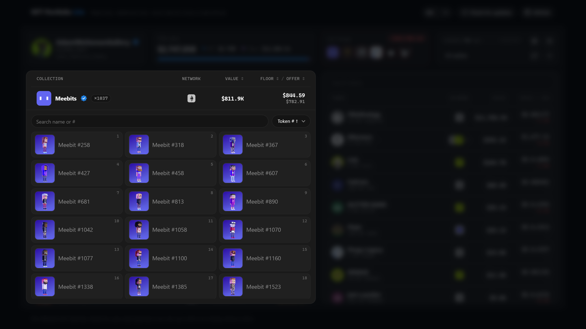
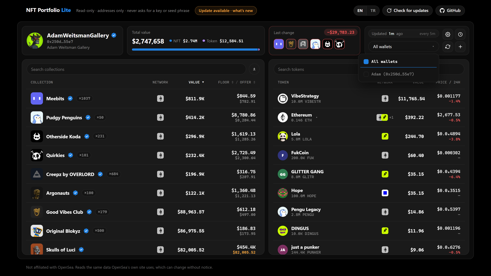
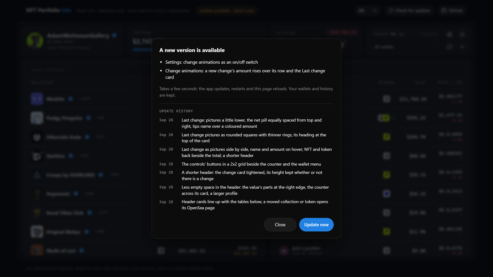
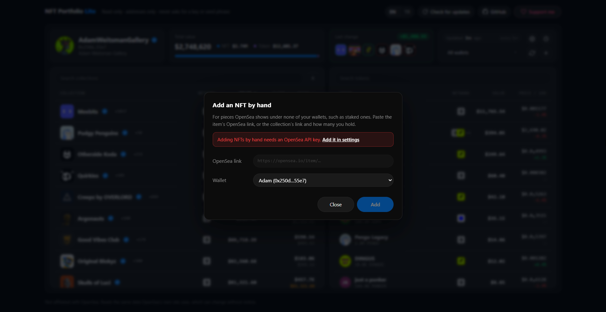
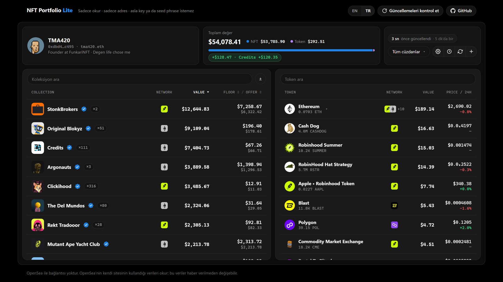
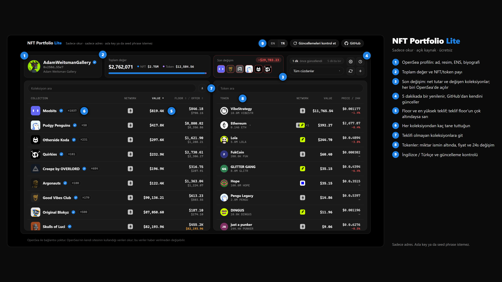

# NFT Portfolio Lite

A light, fast, **read-only** view of your OpenSea portfolio — every NFT and token across all your wallets, in two tables.



OpenSea's own portfolio page ships megabytes of app code, a heatmap and animations to show you a list. On a large wallet it can all but freeze the browser. This reads the same numbers and draws them plainly:

- **Your profile at the top** — your OpenSea name, picture, ENS and bio, then the total value with its NFT / token split, and the latest change with the collections that moved.
- **Collections table** — how many you hold, value (top offer), floor and top offer, sortable and searchable. Click a row to see the pieces you hold.
- **Collections with no offer** are read after the rest and kept under their own heading, folded, so the value is ready in seconds even on a wallet of 10,000+ pieces.
- **Tokens table** — amount, value, price and 24h change; a token held on several networks opens onto each network.
- **Price history** — what moved your balance and when, by read, hour, 6h, 12h, day or a step of your own; a week is kept.
- **NFTs added by hand** — for pieces OpenSea shows under none of your wallets, such as staked ones.
- **English and Turkish**, and it **updates itself** from GitHub.

> **Your wallet ADDRESS is all it needs.** This app never asks for a private key or a seed phrase and cannot move anything. If something that looks like this app asks for a key, it is not this app — use only this repository.



---

## Start it in your browser (GitHub Codespaces — nothing to install)

1. On this repository's page, click **Code** → **Codespaces** → **Create codespace on main**.
2. Wait a moment: the app updates and starts by itself, and its page opens in a new tab. (If it doesn't, open the **Ports** tab and click the globe next to port 4180 — or type `npm start` in the terminal.)
3. Paste your wallet address(es), give them a short name if you like, and save.



The link Codespaces gives you is **private**: only you, signed in to your GitHub account, can open it. Keep it that way — don't make the port public.

Codespaces is free for personal GitHub accounts up to 60 hours a month, far more than this needs. A codespace goes to sleep by itself after 30 minutes without terminal activity; the page then says so, keeps the last figures and offers a **Wake it up** button, and the codespace carries on where it left off. To stop it yourself: **Code** → **Codespaces** → **⋯** → **Stop**.

## Or run it on your own computer

Needs [Node.js](https://nodejs.org) 18 or newer. No other dependencies.

```
git clone https://github.com/ekremkozz/NFT-Portfolio.git
cd NFT-Portfolio
npm start
```

Then open http://localhost:4180.

---

## Using it

**The pieces you hold.** Click a collection's row: its pieces open right under it, with a search, a filter by wallet and a sort by token number.



**Several wallets.** Add them all under ⚙ settings; the portfolio adds them up. The **All wallets** menu narrows everything — tables, totals, history — to the wallets you tick.



**Staying up to date.** Every start pulls the latest version. When a new one comes out while the app is open, an *Update available* note appears at the top: click it to see what changed, then **Update now** — the app updates, restarts and the page reloads in a few seconds. Left unattended, it applies the update by itself. **Check for updates** asks straight away and shows the update history. Your wallets and history are always kept.

**Change animations.** When a collection's value changes, the amount rises over its row and fades. They can be switched off under ⚙ settings.



## Adding NFTs by hand (optional)

Staked NFTs sit in the staking contract, so OpenSea lists them under none of your wallets. Click **+**, paste the item's OpenSea link (or a collection link and how many you hold), and it is counted with the rest, marked *Manual*.



This one feature needs an **OpenSea API key** ([get one here](https://docs.opensea.io/reference/api-keys)) — everything else works without it. The safest place for it in a codespace is a **Codespaces secret**, which is encrypted by GitHub and never written into the code:

1. GitHub → **Settings** → **Codespaces** → **New secret**
2. Name: `OPENSEA_API_KEY`, value: your key, repository: this one.
3. Restart the codespace.

You can also paste it under the ⚙ settings; it is then stored in `data/` on that machine only and never sent back to the page. An OpenSea API key can only *read* data — it cannot touch your wallets.

## Where your data lives

Everything the app keeps — your wallet list, NFTs added by hand, a week of price changes — is in the `data/` folder of wherever it runs. It is ignored by git and never leaves that machine except as requests to OpenSea for your addresses' public data.

---

## Comparing it with OpenSea's page yourself

[`tools/page-meter.user.js`](tools/page-meter.user.js) is a small [Tampermonkey](https://www.tampermonkey.net/) script that shows the same measurements on both pages: how busy the page keeps the browser, its memory, how many elements it holds and what it downloaded. Install it, open both pages with the same wallet, and compare them at the same moments — while loading, at rest, and after opening a detail. For CPU, the browser's own task manager (Shift+Esc in Chrome and Brave) is the authority; the script explains in its header what it can and cannot see.

## Important

**Not affiliated with OpenSea.** It reads the same data OpenSea's own website reads. Those are not a published API: OpenSea can change them at any time, and when it does this app may show empty tables until it is updated. Values are OpenSea's figures (top offers and floors), not financial advice.

## Support

If this saves you time, there is a support mint — *link coming soon*. It is a thank-you, not an investment: it grants nothing and promises nothing.

## License

[MIT](LICENSE)

---

## Türkçe

OpenSea portfolyonun hafif, hızlı ve **sadece okuyan** bir görünümü: tüm cüzdanlarındaki her NFT ve token, iki tabloda.



OpenSea'nin kendi portfolyo sayfası bir listeyi göstermek için megabaytlarca kod, ısı haritası ve animasyon yükler; büyük bir cüzdanda tarayıcıyı neredeyse dondurur. Bu uygulama aynı rakamları okur ve sade bir şekilde çizer:

- **Üstte profilin**: OpenSea adın, resmin, ENS'in ve biyografin; yanında toplam değer, NFT / token payı ve son değişim.
- **Koleksiyon tablosu**: kaç tane tuttuğun, değer (en yüksek teklif), floor ve teklif; sıralanır ve aranır. Bir satıra tıklayınca tuttuğun parçalar açılır.
- **Teklifi olmayan koleksiyonlar** en son okunur ve kendi başlıkları altında kapalı durur; böylece 10.000+ parçalık bir cüzdanda bile değer saniyeler içinde hazır olur.
- **Token tablosu**: miktar, değer, fiyat ve 24 saatlik değişim; birkaç ağda tutulan bir token her ağa ayrı açılır.
- **Fiyat geçmişi**: bakiyeni neyin ne zaman oynattığı; okuma, saat, 6 saat, 12 saat, gün ya da kendi seçtiğin aralıkla. Bir haftası saklanır.
- **Elle eklenen NFT'ler**: OpenSea'nin hiçbir cüzdanında göstermediği parçalar için, örneğin stake edilmiş olanlar.
- **Türkçe ve İngilizce**; GitHub'dan **kendini günceller**.

> **Tek ihtiyacı cüzdan ADRESİN.** Bu uygulama asla private key ya da seed phrase istemez ve hiçbir şeyi hareket ettiremez. Buna benzeyen bir şey key isterse o bu uygulama değildir; sadece bu repoyu kullan.



### Tarayıcıda başlat (GitHub Codespaces, kurulum yok)

1. Bu sayfada **Code** → **Codespaces** → **Create codespace on main**'e tıkla.
2. Biraz bekle: uygulama kendini günceller, kendiliğinden başlar ve sayfası yeni sekmede açılır. (Açılmazsa **Ports** sekmesinde 4180'in yanındaki küreye tıkla ya da terminale `npm start` yaz.)
3. Cüzdan **adreslerini** (0x…) yapıştır, istersen kısa bir ad ver ve kaydet. Sağ üstteki **TR** ile dili Türkçe yapabilirsin.

Codespaces'in verdiği bağlantı **özeldir**: onu sadece GitHub hesabına giriş yapmış olan sen açabilirsin. Öyle kalsın; portu herkese açık yapma.

Codespaces kişisel GitHub hesaplarında ayda 60 saate kadar ücretsizdir; bu uygulamanın ihtiyacından çok fazla. Terminalde 30 dakika hareket olmazsa codespace kendiliğinden uyur; aylık süreni yemesin diye bu iyidir. Sayfa bunu söyler, son rakamları gösterir ve bir **Uyandır** düğmesi sunar; codespace yeniden açılınca kaldığı yerden devam eder. Kendin durdurmak için: **Code** → **Codespaces** → **⋯** → **Stop**.

### Ya da kendi bilgisayarında çalıştır

[Node.js](https://nodejs.org) 18 ya da daha yenisi gerekir, başka bir şey gerekmez.

```
git clone https://github.com/ekremkozz/NFT-Portfolio.git
cd NFT-Portfolio
npm start
```

Sonra http://localhost:4180 adresini aç.

### Kullanım

**Tuttuğun parçalar.** Bir koleksiyonun satırına tıkla: parçaları hemen altında açılır; arama, cüzdana göre süzme ve token numarasına göre sıralama vardır.

**Birden çok cüzdan.** Hepsini ⚙ ayarlardan ekle; portfolyo hepsini toplar. **Tüm cüzdanlar** menüsü tabloları, toplamları ve geçmişi işaretlediğin cüzdanlara daraltır.

**Güncel kalmak.** Her açılışta son sürümü çeker. Uygulama açıkken yeni sürüm çıkarsa üstte *Güncelleme var* notu belirir: tıklayıp neyin değiştiğine bak, **Şimdi güncelle**'ye bas; uygulama birkaç saniyede güncellenir, yeniden başlar ve sayfa yenilenir. Kimse bakmıyorsa güncellemeyi kendisi uygular. **Güncellemeleri kontrol et** hemen sorar ve güncelleme geçmişini gösterir. Cüzdanların ve geçmişin her zaman korunur.

**Değişim animasyonları.** Bir koleksiyonun değeri değişince tutar satırın üstünde yükselip kaybolur. ⚙ ayarlardan kapatılabilir.

### Elle NFT eklemek (isteğe bağlı)

Stake edilmiş NFT'ler staking kontratında durur, bu yüzden OpenSea onları hiçbir cüzdanında göstermez. **+**'ya tıkla, parçanın OpenSea bağlantısını (ya da koleksiyon bağlantısını ve kaç tane tuttuğunu) yapıştır; diğerleriyle birlikte sayılır ve *Manual* olarak işaretlenir.

Sadece bu özellik bir **OpenSea API anahtarı** ister ([buradan al](https://docs.opensea.io/reference/api-keys)); geri kalan her şey onsuz çalışır. Codespace'te en güvenli yeri bir **Codespaces secret**'tır; GitHub onu şifreler ve koda asla yazılmaz:

1. GitHub → **Settings** → **Codespaces** → **New secret**
2. Ad: `OPENSEA_API_KEY`, değer: anahtarın, repo: bu repo.
3. Codespace'i yeniden başlat.

İstersen ⚙ ayarlara da yapıştırabilirsin; o zaman sadece o makinedeki `data/` klasöründe saklanır ve sayfaya bir daha gönderilmez. OpenSea API anahtarı sadece veri *okuyabilir*, cüzdanlarına dokunamaz.

### Verilerin nerede

Uygulamanın sakladığı her şey (cüzdan listen, elle eklenen NFT'ler, bir haftalık fiyat değişimleri) çalıştığı yerdeki `data/` klasöründedir. Git onu yok sayar; adreslerinin herkese açık verileri için OpenSea'ye giden istekler dışında o makineden hiç çıkmaz.

### Önemli

**OpenSea ile bağlantısı yoktur.** OpenSea'nin kendi sitesinin okuduğu verileri okur. Bunlar yayımlanmış bir API değildir: OpenSea onları her an değiştirebilir, değiştirdiğinde uygulama güncellenene kadar tablolar boş görünebilir. Değerler OpenSea'nin rakamlarıdır (en yüksek teklifler ve floor'lar), yatırım tavsiyesi değildir.

Bu uygulama **asla** private key ya da seed phrase istemez. İsteyen bir şey görürsen o bu uygulama değildir.
